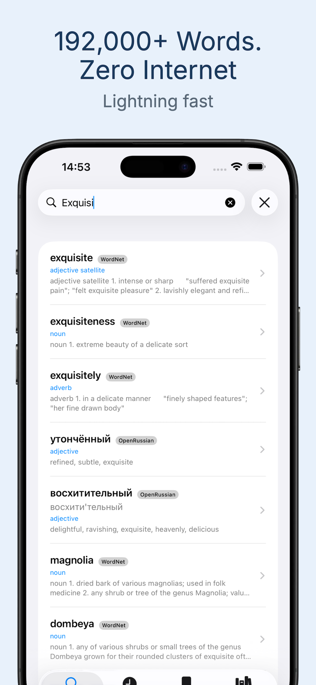
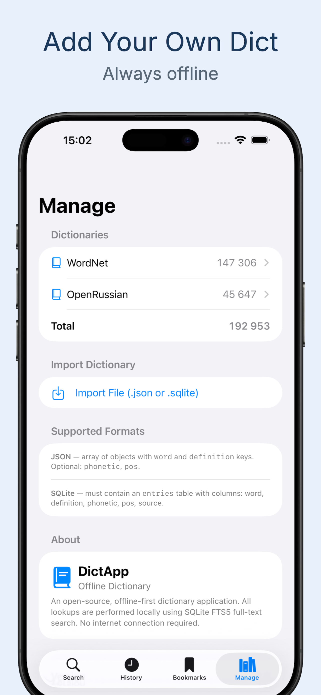
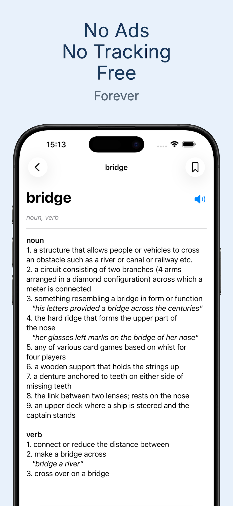

# LibreDict — Minimalist Offline Dictionary

**192,000+ words at your fingertips. No internet. No ads. No tracking. Just words.**

[](https://swift.org)
[](https://developer.apple.com/ios/)
[](LICENSE)

---

## Features

- **Fully Offline** — All 192,000+ words stored locally. Works without any internet connection.
- **Instant Search** — FTS5 full-text search delivers results in milliseconds as you type.
- **Two Built-in Dictionaries** — WordNet (English) and OpenRussian (Russian-English) out of the box.
- **Import Your Own** — Add custom dictionaries via `.json` or `.sqlite` files.
- **Zero Ads, Zero Tracking** — No analytics, no telemetry, no third-party SDKs.
- **Bookmarks & History** — Save words and revisit recent lookups from the home screen.
- **Text-to-Speech** — Hear the pronunciation of any word with one tap.
- **Clean, Minimalist UI** — Designed to get out of your way.

## Screenshots

| Search | Definition | Manage |
|:---:|:---:|:---:|
|  |  |  |

## Tech Stack

| Component | Technology |
|-----------|------------|
| UI | SwiftUI (iOS 17+) |
| Database | SQLite via [GRDB.swift](https://github.com/groue/GRDB.swift) |
| Search | FTS5 full-text search with `unicode61` tokenizer |
| Concurrency | Swift `actor` + `async/await` |
| TTS | AVSpeechSynthesizer |
| Architecture | MVVM |

## Getting Started

### Prerequisites

- Xcode 15.0+
- iOS 17.0+ deployment target

### Build & Run

```bash
git clone https://github.com/kyukhin/dict-app.git
cd dict-app/DictApp
open DictApp.xcodeproj
```

> **Note:** This repo uses [Git LFS](https://git-lfs.github.com) for large database files (`.sqlite`). Make sure Git LFS is installed (`brew install git-lfs && git lfs install`) before cloning, or run `git lfs pull` after cloning to fetch the seed database.

Select your target device or simulator and hit **Run** (Cmd+R). Xcode will resolve the GRDB Swift Package dependency automatically.

### Rebuild the Seed Database (Optional)

The pre-built `seed.sqlite` is already included. To regenerate it from source:

```bash
python3 -m venv .venv
source .venv/bin/activate
pip install nltk requests
python Scripts/build_seed.py
```

## Project Structure

```
LibreDict/
├── DictApp/
│   ├── DictApp.xcodeproj
│   ├── DictApp/
│   │   ├── Models/          # Data models (Entry, Bookmark, Metadata)
│   │   ├── Services/        # DatabaseService, SpeechService
│   │   ├── ViewModels/      # Search, History, Bookmarks, Definition
│   │   ├── Views/           # SwiftUI views
│   │   ├── Extensions/
│   │   └── Resources/       # Schema.sql, seed.sqlite
│   └── DictAppTests/
├── Scripts/
│   └── build_seed.py        # Downloads WordNet + OpenRussian → seed.sqlite
└── Screenshots/
```

## Dictionary Sources

| Dictionary | Language | Entries | License |
|-----------|----------|---------|---------|
| [WordNet 3.1](https://wordnet.princeton.edu/) | English | 147,306 | BSD-style (Princeton University) |
| [OpenRussian](https://openrussian.org/) | Russian-English | 45,647 | CC BY-SA 4.0 |

## License

This project is licensed under the MIT License — see the [LICENSE](LICENSE) file for details.

Dictionary data retains its original licensing (WordNet BSD, OpenRussian CC BY-SA 4.0).
